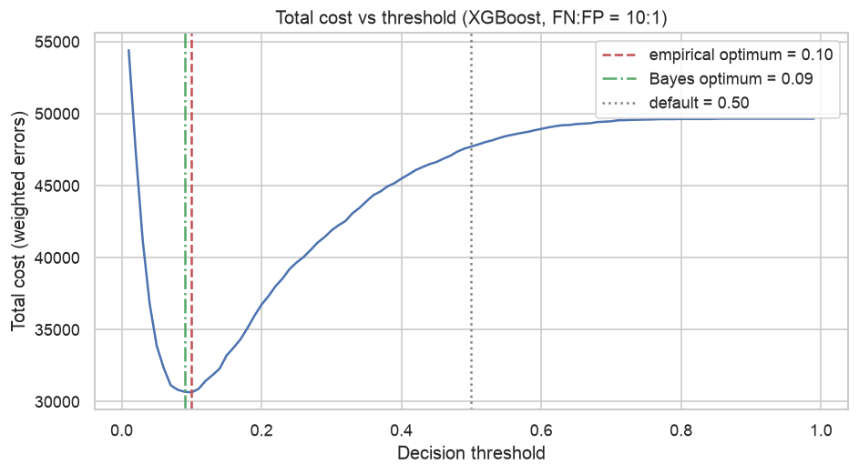
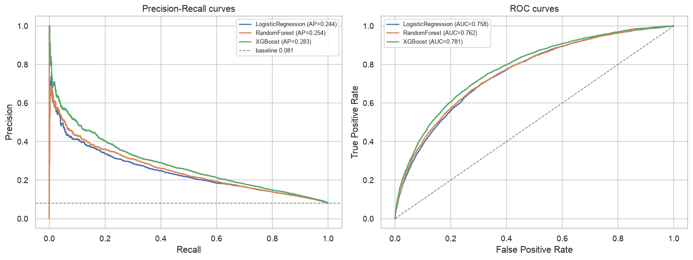
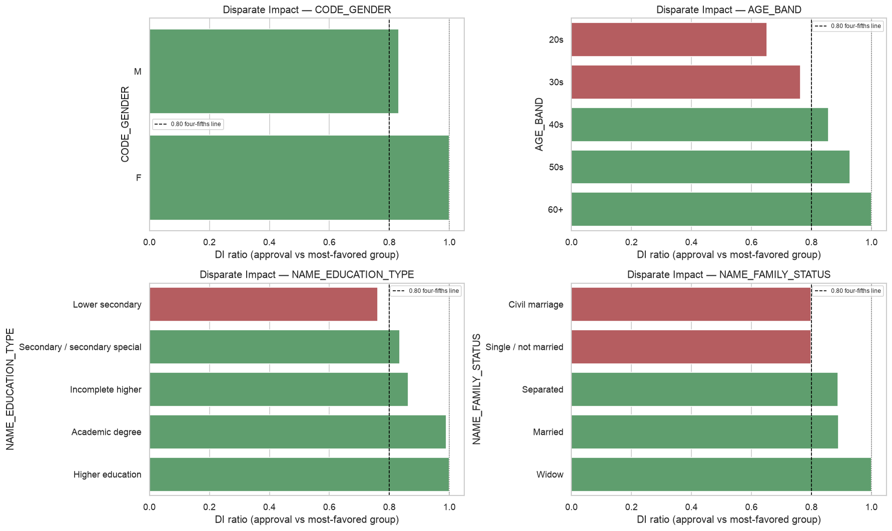
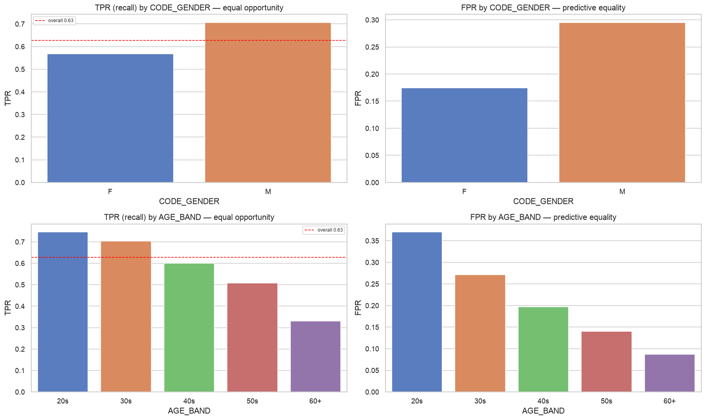

# Credit Default Risk with Fair Lending Audit

> **A credit-default model whose approval cutoff is set by what errors cost the lender, audited for fair lending across protected groups, with the governance documents a regulated deployment needs.**

  

---

## TL;DR

| | |
|---|---|
| **Question** | Where should a lender set its approval cutoff when a missed default costs about 10× a wrongly declined applicant, and is that cutoff fair across applicant groups? |
| **Answer** | XGBoost at threshold **0.10**, not the default 0.5 (close to the analytical Bayes optimum of 0.091) |
| **Result** | Defaulter recall rises from **0.04 to 0.63** on 61,503 validation applicants (PR-AUC 0.283 vs. a 0.081 baseline, ROC-AUC 0.781) |
| **Fair lending** | Age fails the four-fifths rule (**DI 0.65**, applicants in their 20s), education too (DI 0.76); gender passes DI but shows a 0.14 recall gap |
| **Mitigation** | Dropping `CODE_GENDER` costs 0.4% PR-AUC and lifts gender DI 0.83 → 0.90, halving the recall gap |

---

## 📋 Project Overview

This project builds a credit-default model the way a lender would need to put one into production: the cutoff reflects the business cost of each type of error, and the model is checked for discriminatory outcomes before anyone relies on it.

**Why this matters:** a model that predicts "everyone repays" is 92% accurate and catches zero defaulters, so accuracy tells a lender nothing. What matters is how many defaults the cutoff catches, what it costs in wrongly declined applicants, and whether those declines fall disproportionately on protected groups. Credit scoring is High-Risk under the EU AI Act and subject to ECOA / Regulation B in the US, so the fairness check is part of the model, not an afterthought.

---

## 📊 Dataset

**Home Credit Default Risk** — consumer loan applications with repayment history from prior credit.

| | |
|---|---|
| **Source** | [Kaggle: Home Credit Default Risk](https://www.kaggle.com/competitions/home-credit-default-risk) |
| **Size** | 307,511 applicants · 10 tables (~2.5 GB) |
| **Features used** | 96 (59 from the main application table incl. 4 engineered affordability ratios, 37 aggregates from 6 credit-history tables) |
| **Target** | `TARGET` — 1 = payment difficulties (default), 0 = repaid |
| **Imbalance** | **8.07%** default (≈ 11.4 : 1) |

---

## 🏗️ Project Structure

```
credit-default-risk/
│
├── notebooks/
│   ├── 01_data_understanding.ipynb     # 10-table inventory, schema, protected attributes, missingness
│   ├── 02_eda_main_table.ipynb         # Default drivers, data-quality issues, pre-model group gaps
│   ├── 03_preprocessing_features.ipynb # History-table aggregates, leakage-free impute/scale
│   ├── 04_modeling.ipynb               # LogReg → RF → XGBoost; cost-based threshold
│   └── 05_evaluation_fairlending.ipynb # Disparate impact, error-rate gaps, mitigation test
│
├── docs/                               # ⭐ Governance documentation
│   ├── MODEL_CARD.md                   # Model card (Mitchell et al. structure)
│   ├── FAIR_LENDING_AUDIT.md           # Full audit, findings, mitigation
│   ├── AI_RISK_FRAMEWORK.md            # Risk register (R1–R8), three lines of defense
│   ├── DRIFT_MONITORING.md             # PSI + KRI-style control limits
│   ├── EU_AI_ACT_COMPLIANCE.md         # High-Risk classification & obligations
│   └── NIST_AI_RMF_MAPPING.md          # Govern / Map / Measure / Manage
│
├── results/                            # Generated figures (PNG)
├── data/                               # Kaggle CSVs (git-ignored, regenerable)
├── models/                             # Trained models (git-ignored, regenerable)
├── requirements.txt · LICENSE · README.md
```

---

## 🔍 Key Findings from EDA

- **Strongest predictors are the three external credit scores** (`EXT_SOURCE_1–3`), followed by age, region rating, and employment length.
- **`EXT_SOURCE_1` is ~56% missing**: imputed with a was-missing flag rather than dropped, since the missingness itself carries signal.
- **`DAYS_EMPLOYED` holds a sentinel value (365243) in 18% of rows**: replaced with NaN plus an anomaly flag instead of being treated as a real duration.
- **Default rates already differ by group before any model**: by age (~6.5 pp), education (~9 pp across levels), family status (~4 pp) and gender (~3.1 pp). These set the baseline the fairness audit compares against.

---

## 🚀 Methodology

### Phase 1 — Preprocessing ([03](notebooks/03_preprocessing_features.ipynb))
- Aggregated 6 credit-history tables (bureau, previous applications, card balances, installments) to one row per applicant.
- Stratified 80/20 split (246,008 train / 61,503 validation); median imputation and scaling **fit on train only** → no leakage.

### Phase 2 — Modeling ([04](notebooks/04_modeling.ipynb))
- **Baseline:** Logistic Regression. **Candidates:** Random Forest, **XGBoost**.
- No resampling at training, so predicted probabilities stay calibrated to the real 8% base rate; imbalance is handled at the decision threshold instead.
- **Selection:** PR-AUC, then recall at the cost-optimal cutoff.

### Phase 3 — Cost-Based Threshold ([04](notebooks/04_modeling.ipynb))
- Cost of a missed default set at 10× the cost of a wrongly declined good applicant.
- Empirical cost-optimal threshold **0.10**, checked against the analytical Bayes optimum (**0.091**).

### Phase 4 — Fair Lending Audit ⭐ ([05](notebooks/05_evaluation_fairlending.ipynb))
- **Disparate impact** (four-fifths rule) on approval rates across age, education, family status and gender.
- **Equal opportunity / predictive equality:** recall and false-decline gaps across the same groups.
- **Mitigation test:** retrain without `CODE_GENDER` and compare performance and fairness.

---

## 📈 Results

**Model comparison** (validation set, sorted by PR-AUC):

| Model | **PR-AUC** | ROC-AUC |
|-------|-----------|---------|
| **XGBoost** | **0.283** | 0.781 |
| Random Forest | 0.254 | 0.762 |
| Logistic Regression | 0.244 | 0.759 |

**Selected model — XGBoost at the cost-optimal threshold (0.10):**

| | |
|---|---|
| Recall (defaulters) | **0.63** (vs. 0.04 at 0.50) |
| Precision (defaulters) | 0.20 |
| Defaulters in validation | 4,965 of 61,503 |

> The cutoff is pushed far below 0.5 because a missed default is assumed about 10× costlier than a wrongly declined applicant — a **credit risk-appetite decision**, documented and reviewable, not a technical default.

**⚠️ Fair lending findings:**

| Attribute | Approval DI | Recall gap | Status |
|---|---|---|---|
| **Age** (20s vs. 60+) | **0.65** | ~0.42 | 🔴 Adverse impact |
| **Education** (lower secondary vs. higher) | **0.76** | — | 🔴 Adverse impact |
| **Gender** (male vs. female) | 0.83 | 0.14 | 🟡 Passes DI, recall gap |

**Mitigation:** removing `CODE_GENDER` (a top-3 feature) changes PR-AUC from 0.283 to 0.279 while gender DI improves 0.83 → 0.90 and the recall gap halves 0.14 → 0.07. Age and education need a business-necessity review, logged as open risks R1–R2 in [AI_RISK_FRAMEWORK.md](docs/AI_RISK_FRAMEWORK.md).

| Cost vs. threshold | Model comparison | Disparate impact | Error-rate gaps |
|---|---|---|---|
|  |  |  |  |

**Limitations:** no out-of-time validation (the data is a single static snapshot); age- and education-correlated features can still carry indirect bias after the direct attribute is removed; small subgroups (e.g. academic degree, n = 40) are flagged but not concluded on; the 10:1 cost ratio is an assumption to be replaced with a lender's actual loss and acquisition costs.

---

## 💡 Risk Analyst Perspective

> The cutoff, not the model, is where a lender's risk appetite shows up, so it is chosen from the cost of each error and documented as a decision someone owns. The fair lending audit then asks who absorbs the declines that cutoff creates. Drift monitoring on both default rates and group-level approval gaps (PSI plus KRI-style control limits) is how the same checks keep running after deployment.

---

## 🛠️ Tech Stack

- **Language:** Python 3.11+
- **ML & Data:** pandas, NumPy, scikit-learn, XGBoost
- **Explainability:** XGBoost feature importance
- **Visualization:** matplotlib, seaborn
- **Governance docs:** Markdown (versioned in [`/docs`](docs/))

---

## 🏃 Getting Started

```bash
# Clone
git clone https://github.com/Olivia-Yoob/credit-default-risk.git
cd credit-default-risk

# Environment
python3 -m venv venv
source venv/bin/activate
pip install -r requirements.txt          # xgboost needs libomp on macOS: brew install libomp

# Dataset: download from Kaggle and unzip into ./data/
# (not included in repo due to size)

# Run notebooks in order (01 → 05)
jupyter lab notebooks/
```

---

## 🤖 A Note on AI-Assisted Development

This project uses AI coding assistants for code generation, with outputs validated and refactored by the author. The problem framing, cost assumptions, fair lending methodology, and risk register draw on the author's professional background in financial-services risk.

---

## 📬 Contact

**Olivia Kim (Yoobin Kim)**
- LinkedIn: [linkedin.com/in/olivia-yoobin-kim](https://www.linkedin.com/in/olivia-yoobin-kim/)
- GitHub: [@Olivia-Yoob](https://github.com/Olivia-Yoob)
- Email: yoobink@andrew.cmu.edu

## 📄 License

MIT License — see [LICENSE](LICENSE). Compliance mappings are illustrative and not legal advice.

---

**Project Status:** Completed June 2026
